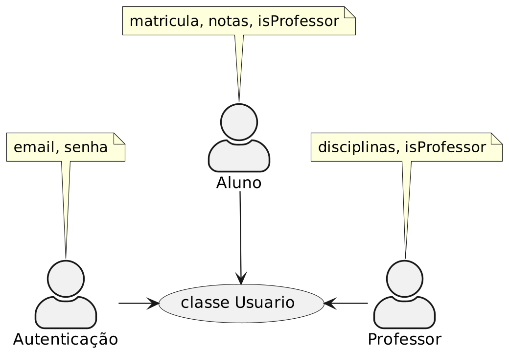

# S.O.L.I.D. Exemplos

* [**S**ingle Responsibility Principle](#single-responsibility-principle)
  * [SRP aplicado no código](#srp-aplicado-no-código)
* [**O**pen/Closed Principle](#open-closed-principle)
  * [OCP aplicado no código](#ocp-aplicado-no-código)
* [**L**iskov Substitution Principle](#liskov-substitution-principle)
* [**I**nterface Segregation Principle](#interface-segregation-principle)
* [**D**ependency Inversion Principle](#dependency-inversion-principle)

## Single Responsibility Principle

> Uma classe deve ter um, e somente um, motivo para mudar[^1].

> Deixe junto as coisas que mudam pela mesma razão. Separe aquelas que mudam por razões diferentes[^1].

O princípio da responsabilidade única fala sobre como diminuir o acoplamento baseado na frequência e na origem das mudanças/alterações no código.

Para entender melhor vamos ver alguns exemplos.

### SRP aplicado no código 

Imagine uma classe chamada de Usuario que representa os usuários com email e senha para acessar um sistema.

```java
class Usuario {
    private final String email;
    private final String senha;
}
```

Agora vamos supor que este sistema é um sistema utilizado para registrar notas dos alunos que frequentam a escola. Então, vamos adicionar um atributo chamado de matrícula e notas.

```java
class Usuario {
    private final String email;
    private final String senha;
    
    // Novas alterações
    private final String matricula;
    private final List<Double> notas;
}
```

Aqui já temos um sinal de que o princípio está sendo quebrado. Mas, vamos continuar para entender o problema.
O nosso sistema está ficando bom. As escolas gostaram e agora querem que o sistema tenha um cadastro de professores. Então, vamos adicionar um atributo chamado de disciplina para saber qual disciplina o professor leciona e um booleano para diferenciar aluno e professor.

```java
class Usuario {
    private final String email;
    private final String senha;
    private final String matricula;
    private final List<Double> notas;
    
    // Eita, está crescendo
    private final String disciplina;
    private final boolean isProfessor;
}
```

Agora o problema fica mais claro. A classe está com mais de uma responsabilidade. Ela está responsável por representar um usuário e também por representar um aluno ou professor. Como este problema aconteceu? Vamos analisar as origens das alterações feitas na classe com o diagrama seguinte:



Temos três casos de uso:

* Autenticar usuário
* Cadastrar aluno
* Cadastrar professor

E uma classe é responsável por representar todos os casos de uso. E este é o problema. Está muito acoplado com **casos de usos** diferentes. 

O custo para alterar a classe Usuario vai ficando cada vez mais caro, pois precisamos verificar se os três casos de uso ainda continuam do jeito que deveria se comportar.

Para solucionar, o princípio diz: **Separar as coisas que mudam por razões diferentes**. Então, vamos separar a classe Usuario em três classes:Usuario, Aluno e Professor.

```java
class Usuario {
    private final String email;
    private final String senha;
}

class Aluno {
    private final String matricula;
    private final List<Double> notas;
}

class Professor {
    private final String disciplina;
}
```

Agora, cada classe tem uma responsabilidade e tem somente uma razão para mudar.


[^1]: https://blog.cleancoder.com/uncle-bob/2014/05/08/SingleReponsibilityPrinciple.html

## Open/Closed Principle

> Entidades de software (classes, módulos, funções, etc.) devem ser abertas para extensão, mas fechadas para modificação[^2].

[^2]: https://en.wikipedia.org/wiki/Open%E2%80%93closed_principle

Módulos que atendem o princípio aberto/fechado possuem dois principais atributos:

* Eles estão "abertos para extensão"
* Eles estão "fechados para modificação"

Conseguimos atingir estes dois atributos utilizando abstração.

### OCP aplicado no código

Vamos ver o que acontece com um código que não atende o princípio aberto/fechado para depois arrumarmos o problema.

Vamos supor que temos um sistema que é possível simular um dia de trabalho de uma equipe ágil.

```java
class EquipeAgil {
    public void simulaUmDiaDeTrabalho() {
    }
}
```

Agora, vamos começar a montar o time. Primeiro, vamos adicionar desenvolvedores.

```java
class EquipeAgil {
    private final List<Desenvolvedor> desenvolvedores = new ArrayList<>();

    public void simulaUmDiaDeTrabalho() {
        for (Desenvolvedor desenvolvedor : desenvolvedores) {
            desenvolvedor.desenvolve();
        }
    }
    
    public void adicionaDesenvolvedor(Desenvolvedor desenvolvedor) {
        desenvolvedores.add(desenvolvedor);
    }
}

class Desenvolvedor {
    public void desenvolve() {
        System.out.println("Desenvolvendo");
    }
}
```

Percebemos que precisamos de testadores, para ensinar os desenvolvedores a testar e ajudar a equipe a se preocupar com qualidade. Logo, vamos adicionar testadores.

```java
class EquipeAgil {
    private final List<Desenvolvedor> desenvolvedores = new ArrayList<>();
    private final List<Testador> testadores = new ArrayList<>();

    public void simulaUmDiaDeTrabalho() {
        for (Desenvolvedor desenvolvedor : desenvolvedores) {
            desenvolvedor.desenvolve();
        }
        // Para cada novo perfil, preciso adicionar um novo loop
        for (Testador testador : testadores) {
            testador.testa();
        }
    }
    
    public void adicionaDesenvolvedor(Desenvolvedor desenvolvedor) {
        desenvolvedores.add(desenvolvedor);
    }
    
    // Para cada novo perfil, preciso criar um método para adicionar
    public void adicionaTestador(Testador testador) {
        testadores.add(testador);
    }
}

class Desenvolvedor {
    public void desenvolve() {
        System.out.println("Desenvolvendo");
    }
}

class Testador {
    public void testa() {
        System.out.println("Testando");
    }
}
```

Veja o problema aqui. Com o design que temos agora, para cada profissional com novo perfil na equipe, precisamos modificar a classe EquipeAgil. Ou seja, esta classe não está fechada para modificação. Por consequência, temos um custo maior para alterar o comportamento do nosso código.

Para resolver este problema criamos uma abstração para representar todas as necessidades da classe EquipeAgil. Vamos chamar, por exemplo, essa abstração de Profissional e implementá-las nas classes Desenvolvedor e Testador. E também vamos utilizar a abstraction Profissional na classe EquipeAgil.

```java
interface Profissional {
    void executa();
}

// Nunca mais precisamos modificar esta classe
class EquipeAgil {
    private final List<Profissional> profissionais = new ArrayList<>();

    public void simulaUmDiaDeTrabalho() {
        // Não importa o perfil, todos executam
        for (Profissional profissional : profissionais) {
            profissional.executa();
        }
    }
    
    // Não importa o perfil, todos são adicionados por este método
    public void adicionaProfissional(Profissional profissional) {
        profissionais.add(profissional);
    }
}

class Desenvolvedor implements Profissional {
    public void desenvolve() {
      System.out.println("Desenvolvendo");
    }
    
    @Override
    public void executa() {
        this.desenvolve();
    }
}

class Testador implements Profissional {
    public void testa() {
        System.out.println("Testando");
    }
    
    @Override
    public void executa() {
        this.testa();
    }
}
```

O importante é que agora, a classe EquipeAgil não precisa mais ser modificada para adicionar novos profissionais. 

Ela tem os dois principais atributos:

* "Aberta para extensão"
  * Para adicionar novos profissionais, basta criar uma classe que implemente a interface Profissional.
* "Fechada para modificação"
  * Não precisamos modificar a classe EquipeAgil para adicionar novos profissionais.

Se quisermos adicionar agora um gerente de projeto, o código fica assim:

```java
interface Profissional {
  void executa();
}

class EquipeAgil {
  private final List<Profissional> profissionais = new ArrayList<>();

  public void simulaUmDiaDeTrabalho() {
    for (Profissional profissional : profissionais) {
      profissional.executa();
    }
  }

  public void adicionaProfissional(Profissional profissional) {
    profissionais.add(profissional);
  }
}

class Desenvolvedor implements Profissional {
  public void desenvolve() {
    System.out.println("Desenvolvendo");
  }

  @Override
  public void executa() {
    this.desenvolve();
  }
}

class Testador implements Profissional {
  public void testa() {
    System.out.println("Testando");
  }

  @Override
  public void executa() {
    this.testa();
  }
}

// Só preciso criar uma classe que implementa Profissional
class GerenteDeProjeto implements Profissional {
    public void gerencia() {
        System.out.println("Gerenciando");
    }
    
    @Override
    public void executa() {
        this.gerencia();
    }
}
```


## Liskov Substitution Principle

> Os serviços da classe derivada não devem exigir mais e prometer nada menos do que os serviços correspondentes da classe base[^3].

> A função que usa uma classe base deve conseguir usar suas subclasses sem distinguir[^3].

[^3]: https://en.wikipedia.org/wiki/Liskov_substitution_principle

## Interface Segregation Principle

> Muitas interfaces específicas são melhores do que uma interface única geral[^4].

[^4]: https://en.wikipedia.org/wiki/Interface_segregation_principle

## Dependency Inversion Principle

> Módulos de alto nível não devem depender de módulos de baixo nível. Ambos devem depender de abstrações[^5].

[^5]: https://en.wikipedia.org/wiki/Dependency_inversion_principle

