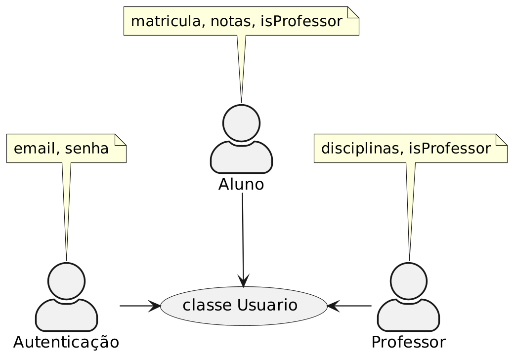

### SRP aplicado no código

Imagine uma classe chamada de Usuario que representa os usuários com email e senha para acessar um sistema.

```java
class Usuario {
    private final String email;
    private final String senha;
}
```

Agora vamos supor que este sistema é um sistema utilizado para registrar notas dos alunos que frequentam a escola. Então, vamos adicionar um atributo chamado de matrícula e notas.

```java
class Usuario {
    private final String email;
    private final String senha;
    
    // Novas alterações
    private final String matricula;    
    private final List<Double> notas;
}
```

Aqui já temos um sinal de que o princípio está sendo quebrado. Mas, vamos continuar para entender o problema.
O nosso sistema está ficando bom. As escolas gostaram e agora querem que o sistema tenha um cadastro de professores. Então, vamos adicionar um atributo chamado de disciplina para saber qual disciplina o professor leciona e um booleano para diferenciar aluno e professor.

```java
class Usuario {
    private final String email;
    private final String senha;
    private final String matricula;
    private final List<Double> notas;
    
    // Eita, está crescendo
    private final String disciplina;
    private final boolean isProfessor;
}
```

Agora o problema fica mais claro. A classe está com mais de uma responsabilidade. Ela está responsável por representar um usuário e também por representar um aluno ou professor. Como este problema aconteceu? Vamos analisar as origens das alterações feitas na classe com o diagrama seguinte:



Temos três casos de uso:

* Autenticar usuário
* Cadastrar aluno
* Cadastrar professor

E uma classe é responsável por representar todos os casos de uso. E este é o problema. Está muito acoplado com **casos de usos** diferentes.

O custo para alterar a classe Usuario vai ficando cada vez mais caro, pois precisamos verificar se os três casos de uso ainda continuam do jeito que deveria se comportar.

Para solucionar, o princípio diz: **Separar as coisas que mudam por razões diferentes**. Então, vamos separar a classe Usuario em três classes:Usuario, Aluno e Professor.

```java
class Usuario {
    private final String email;
    private final String senha;
}

class Aluno {
    private final String matricula;
    private final List<Double> notas;
}

class Professor {
    private final String disciplina;
}
```

Agora, cada classe tem uma responsabilidade e tem somente uma razão para mudar.